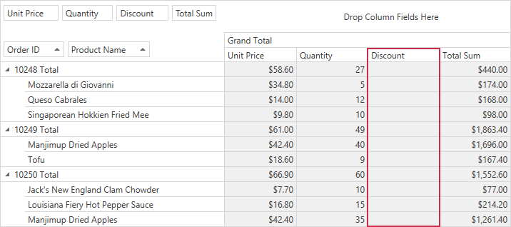

<!-- default badges list -->

<!-- default badges end -->

# Pivot Grid for WPF - Hide Column Totals

This example demonstrates how to handle the [CustomCellValue](https://docs.devexpress.com/WPF/DevExpress.Xpf.PivotGrid.PivotGridControl.CustomCellValue?p=netframework) event to hide the _Discount_ field column grand totals. 

## Files to Review

* [MainWindow.xaml](./CS/HowToBindToMDB/MainWindow.xaml) (VB: [MainWindow.xaml](./VB/HowToBindToMDB/MainWindow.xaml))
* [MainWindow.xaml.cs](./CS/HowToBindToMDB/MainWindow.xaml.cs) (VB: [MainWindow.xaml.vb](./VB/HowToBindToMDB/MainWindow.xaml.vb))

## Documentation

- [CustomCellValue](https://docs.devexpress.com/WPF/DevExpress.Xpf.PivotGrid.PivotGridControl.CustomCellValue?p=netframework)
- [Grand Totals](https://docs.devexpress.com/WPF/8001/controls-and-libraries/pivot-grid/ui-elements/grand-totals?p=netframework)

